# OML Tutorial： Ontological Analysis 101

## Ontological Modeling and Analysis 

OMLを使ったOntological Modeling and Analysisのワークフローの特徴は、他のシステムモデリング言語と異なり、モデリングの後に、構築したモデルをセマンティックナレッジグラフに変換し、これを探索（クエリー）して分析するプロセスにあります。

  1. Vocabularyモデリング（オントロジー or メタモデル）
  2. Descriptionモデリング（インスタンス）
  3. モデルのビルド
  4. モデルのロード
  5. モデルのクエリ

- 今回のチュートリアルでは、OMLの特徴である構築したモデルをクエリーして分析する`Ontological Analysis`に焦点をあてたウォークスルーを実際に体験して頂きます。


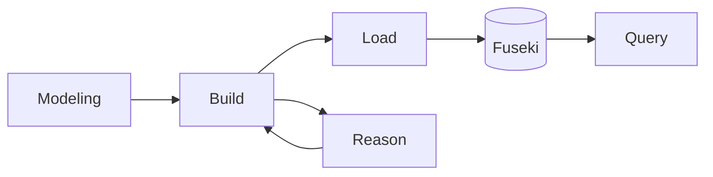

## Github Codespaceで実行する場合

右上の緑色の`code`をクリックし、`Create codespace on main` をクリック。
これだけて必要なOML開発環境がクラウド上で構築され、VSCODEをブラウザ上で開くことができます。

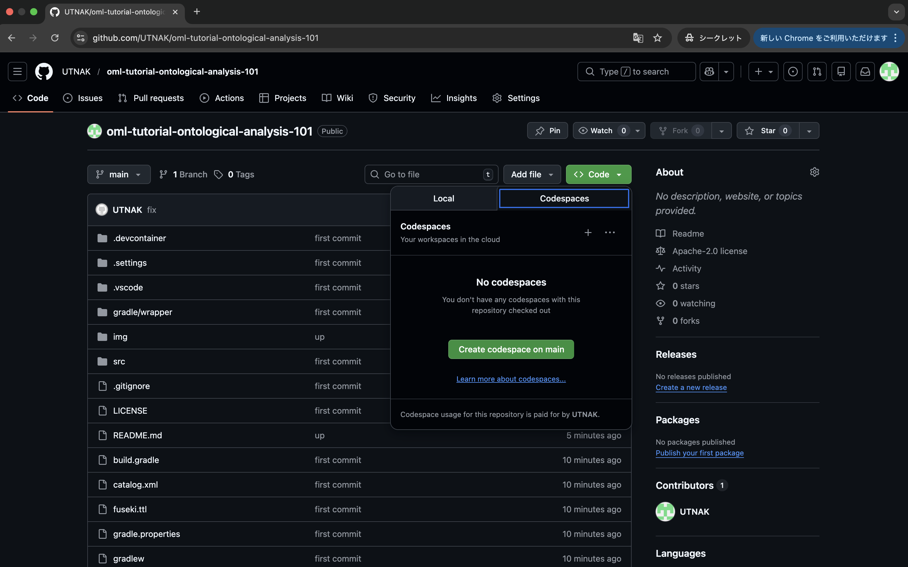

しばらくすると下記のような画面になります

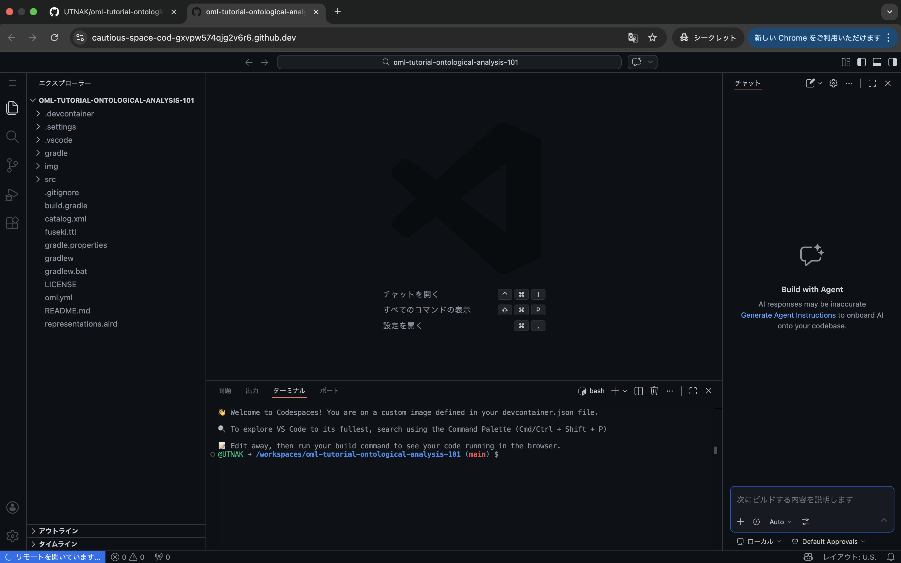


ローカル環境を構築する前のクイックウォークスルーとして活用頂けます。


## Local環境の構築方法

- cloneしてdevcontainerとしてもよい
- java環境構築


## Local環境で実行する場合

### Repositoryをクローンする。

```
git clone https://github.com/UTNAK/oml-tutorial-ontological-analysis-101.git
cd oml-tutorial-ontological-analysis-101
```

## First Query

### ターミナルを立ち上げる

左上の`≡`をクリックしてTerminalを表示する。

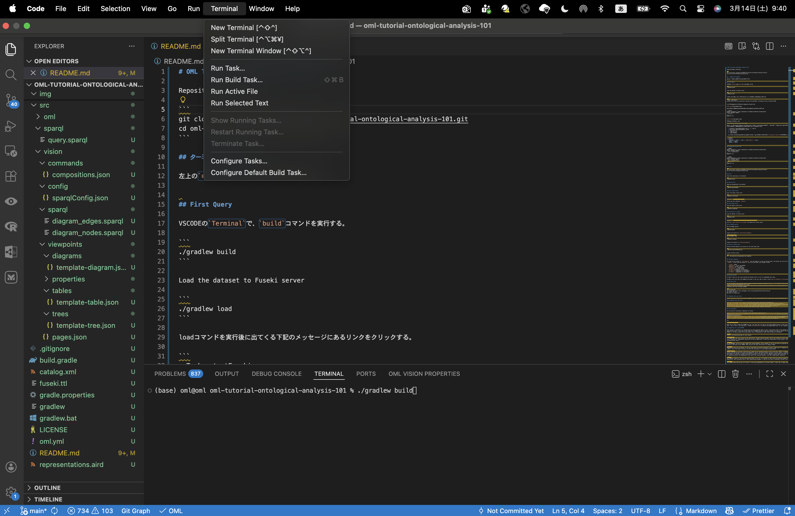


### モデルのビルド

VSCODEの`Terminal`で、`build`コマンドを実行する。

ターミナルで下記コードを実行する。

```bash
./gradlew build
```

下記のように `BUILD SUCCESSFUL`となることを確認する。

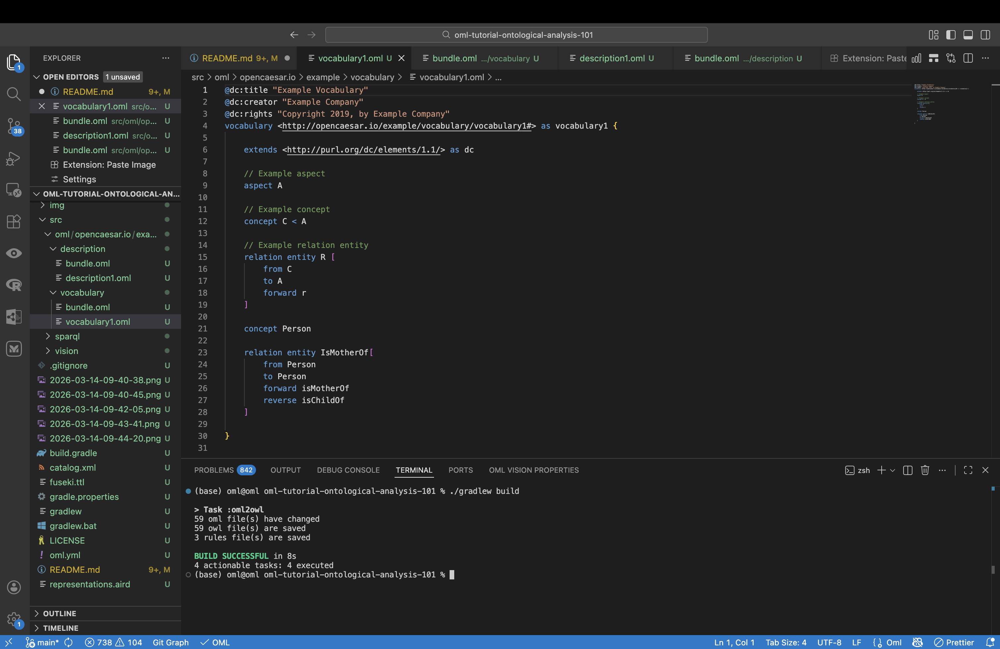


### モデルのLoad

```bash
./gradlew load
```

loadコマンドを実行後に出てくる下記のメッセージにあるリンクをクリックする。

```bash
> Task :startFuseki
Fuseki server has now successfully started with pid=78110, listening on http://localhost:3030
```

> [!CAUTION]
> エラーとなった場合は下記コマンドで対応する

```bash
kill -9 $(lsof -i:3030)
```

```bash
netstat -ano | findstr :3030
taskkill /PID xxxxx /F
```


ブラウザ上で下記のような`Fuseki Endpoint`が立ち上がる。

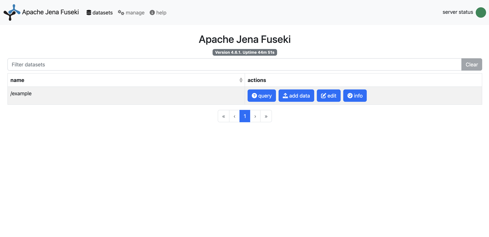

### モデルのクエリー

`Query` をクリックし、以下のSPARQLクエリを入力します。
出てきた画面の右上にある`Run Query`をクリックすると、クエリー結果が表示されます。

```sparql
PREFIX vocabulary1: <http://opencaesar.io/example/vocabulary/vocabulary1#>
SELECT DISTINCT* WHERE {
  ?s ?p ?o
}
ORDER BY ?iri
```

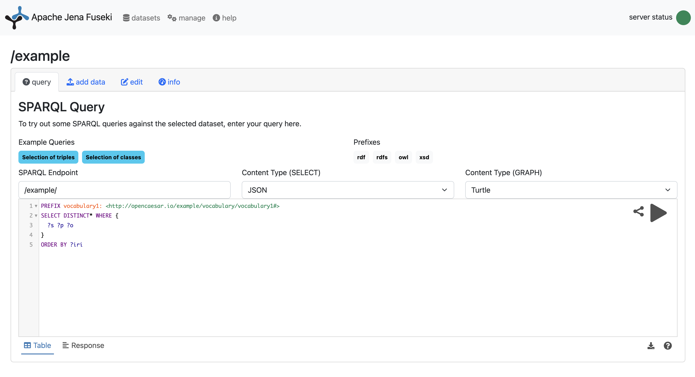


Build -> Load　を通じて、OMLモデルがOWL RDFグラフデータに変換され、ローカルサーバ上のグラフデータベースにストアされます。
openCAESARのプラットフォームでは、グラフデータをクエリするためのWeb UIとして、Fuseki Endpointが用意されています。

この`Fuseki Web UI（Webコンソール）`は、[Apache Jena Fuseki](https://jena.apache.org/index.html) が提供する
ブラウザベースの管理画面で、[SPARQLクエリ](https://www.w3.org/TR/sparql11-query/)実行・データセット管理・データ操作を行える GUI です。

> Semantic Webの世界では、`Knowledge Graph`を扱うための技術が標準化されており、openCAESARはこの[世界標準のセマンティックウェブ技術](https://www.w3.org/2001/sw/wiki/Main_Page)に基づいたツールセットを構築しています。
> `Knowledge Graph`のイントロダクションとして参考になる情報は[こちら](https://github.com/Edkamb/Edkamb.github.io/blob/master/files/keynote.pdf)。
> 


クエリの入力部分に、SPARQLクエリを打ち込むことで、グラフデータにアクセスできます。以下にいくつかのパターンを示します。


### Query実験その１ 

これは、グラフデータベース上の全てのデータを取得するクエリです。

```SPARQL
SELECT ?subject ?predicate ?object
WHERE {
  ?subject ?predicate ?object
}
LIMIT 25
```

## Ontological Analysis

 - VocabularyとDescriptionの違い
 - OMLのモデル構成
 - Vocabularyを使ったクエリー


```SPARQL
PREFIX vocabulary1: <http://opencaesar.io/example/vocabulary/vocabulary1#>
SELECT DISTINCT* WHERE {
  ?iri a vocabulary1:C
}
ORDER BY ?iri
```

```SPARQL
PREFIX vocabulary1: <http://opencaesar.io/example/vocabulary/vocabulary1#>
SELECT DISTINCT* WHERE {
  ?iri a vocabulary1:C;
  	vocabulary1:r ?iri2.
}
ORDER BY ?iri
```


## Ontological Modeling and Analysis 101

ここでは、サザエさんを例に、OMLの`Vocabulary`と`Description`のモデリングを体験します。

### ケーススタディ: 母の母は祖母である

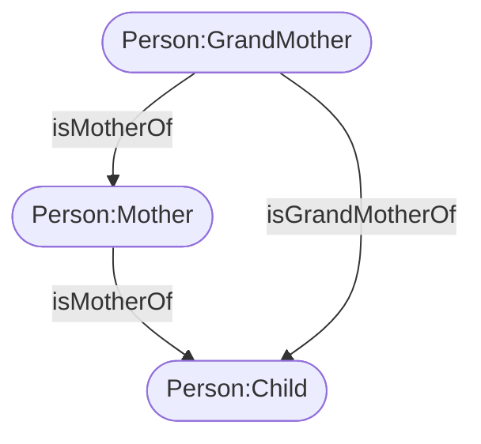

> 
> Concept
> 
> `Person`
> - サザエさんは人である
> - フネは人である
> - タラヲは人である


> Relationships
> 
> `母である isMotherOf`
> - フネはサザエの母である
> - サザエはタラヲの母である


> Inference: 
> 
>  `母の母は祖母である`
>  * フネはサザエの母である
>  * サザエはタラヲの母である
>  * すなわち、フネはタラヲの祖母である。

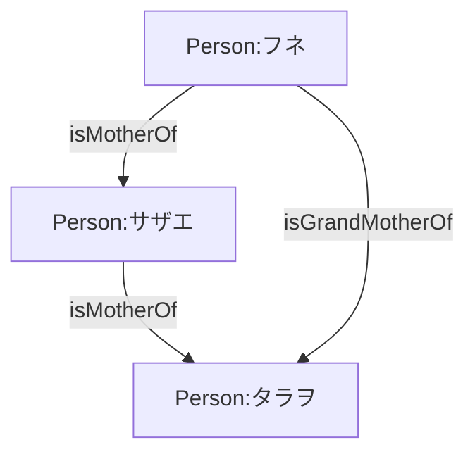


#### Vocabulary

`src/oml/opencaesar.io/example/vocabulary/vocabulary1.oml`を開く。


- 全ての人を表す概念として、`Concept Person`　を定義する。
- 母であるという関係性を表す`relation entity IsMotherOf` を定義する。

```oml
concept Person

relation entity IsMotherOf[
  from Person
  to Person
  forward isMotherOf
  reverse isChildOf
]
```

モデルが正しく構築されたかをチェックするため、ビルドする。

```bash
./gradlew build
```

エラーが出なければOK。


#### Descriptions

次に、定義したVocabularyを使って`Description`を記述します。

`src/oml/opencaesar.io/example/description/description1.oml`を開く。

サザエ、タラヲ、フネを定義する。

```oml
instance tarao : vocabulary1:Person
instance sazae : vocabulary1:Person
instance fune : vocabulary1:Person
```

#### Query Person

モデルが正しく構築されたかをチェックするため、ビルドし、ロードして、クエリーしてみます。

```bash
./gradlew load
```

> [!WARNING]
> `load`コマンドは、`build`を含んでおり、これだけで`build`+`load`を実行してくれます。
>


Fuseki Web UI上で下記のクエリを実行します。

```SPARQL
PREFIX vocabulary1: <http://opencaesar.io/example/vocabulary/vocabulary1#>
SELECT DISTINCT* WHERE {
  ?iri a vocabulary1:Person;
}
ORDER BY ?iri
```

下記のような結果が得られます。

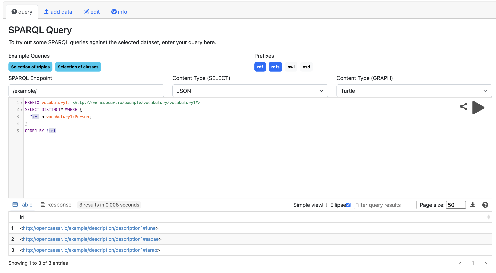


#### Relationの追加

`src/oml/opencaesar.io/example/description/description1.oml`を開く。
下記のDescriptionを追加します。

```oml
instance tarao : vocabulary1:Person
instance sazae : vocabulary1:Person[
  vocabulary1:isMotherOf tarao
]
instance fune : vocabulary1:Person[
  vocabulary1:isMotherOf sazae
]
```

モデルが正しく構築されたかをチェックするため、ビルドし、ロードして、クエリーしてみます。

```bash
./gradlew load
```

```SPARQL
PREFIX vocabulary1: <http://opencaesar.io/example/vocabulary/vocabulary1#>
SELECT DISTINCT* WHERE {
  ?iri a vocabulary1:Person;
  		vocabulary1:isMotherOf ?child
}
ORDER BY ?iri
```

下記のように、子どもが得られます。

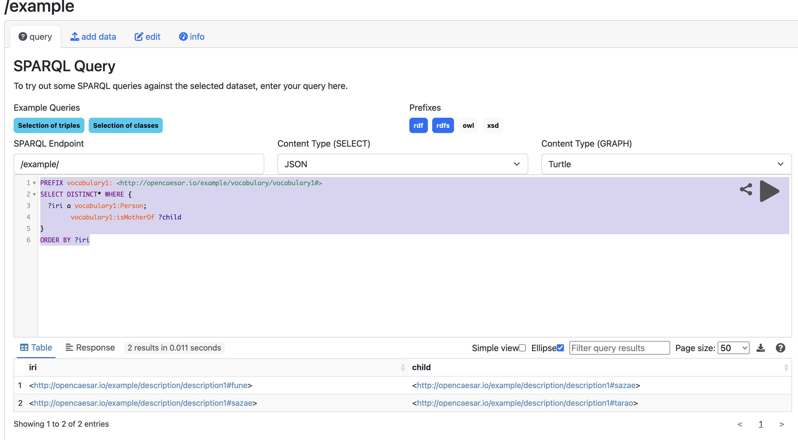

#### Reverse Relationship

ここで、OMLのVocabularyを確認してみる。

```oml
relation entity IsMotherOf[
  from Person
  to Person
  forward isMotherOf
  reverse isChildOf
]
```

定義したVocabularyでは、`Person` Node間の関係性に、`forward` と `reverse`の２種類の関係性を付与しています。

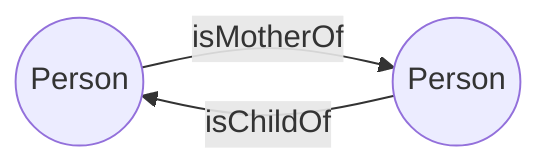

すなわち、SPARQLで下記のように記述することができる。

```SPARQL
PREFIX vocabulary1: <http://opencaesar.io/example/vocabulary/vocabulary1#>
SELECT DISTINCT* WHERE {
  ?iri a vocabulary1:Person;
  		vocabulary1:isChildOf ?child
}
ORDER BY ?iri
```

#### 特定のinstanceを起点としたクエリ

OWL/RDF のグラフデータは、世界の知識をすべて「主語–述語–目的語」の３つ組 (triple) = グラフ構造で表します。それぞれ、ノードとノード間の関係性を表しし、IRI（Internationalized Resource Identifier）と呼ばれる「世界中で一意のリソースを識別するための文字列」 が割り当てられています。IRIは、OWL/RDFにおいて、クラス・個体・プロパティなど すべての概念を一意に識別するための基礎になります。

例えば、サザエさんを表す`instance sazae`には、

```
http://opencaesar.io/example/description/description1#sazae
```

というIRIが割り当てられています。
これを使ったSPARQLクエリを記述してみます。

```SPARQL
PREFIX vocabulary1: <http://opencaesar.io/example/vocabulary/vocabulary1#>
SELECT DISTINCT* WHERE {
  <http://opencaesar.io/example/description/description1#sazae> vocabulary1:isChildOf ?mother.
}
ORDER BY ?iri
```

`サザエは誰の子供であるか？`がわかります。

次に、`reverse`関係を使ってみます。

```SPARQL
PREFIX vocabulary1: <http://opencaesar.io/example/vocabulary/vocabulary1#>
SELECT DISTINCT* WHERE {
  <http://opencaesar.io/example/description/description1#sazae> vocabulary1:isMotherOf ?child.
}
ORDER BY ?iri
```

`サザエの子は誰か？`がわかります。
こんな書き方もできます。

```SPARQL
PREFIX vocabulary1: <http://opencaesar.io/example/vocabulary/vocabulary1#>
SELECT DISTINCT* WHERE {
  <http://opencaesar.io/example/description/description1#sazae> vocabulary1:isChildOf ?mother.
  <http://opencaesar.io/example/description/description1#sazae> vocabulary1:isMotherOf ?child.
}
ORDER BY ?iri
```

### Inference

ここで、`祖母`を定義します。
ある`Person`の`母親の母親`は`祖母である`という関係性を定義します。

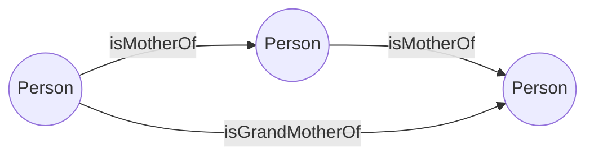

まず、`isGrandMotherOf`をVocabularyに追加する。

```oml
relation entity IsGrandMotherOf[
  from Person
  to Person
  forward isGrandMotherOf
  reverse isGrandChildOf
]
```

#### 手動での関係性定義

次に、funeとtaraを`isGrandMotherOf`で結ぶ
description1.omlのtaraoに以下を追加する。

```oml
	instance tarao : vocabulary1:Person[
		vocabulary1:isGrandChildOf fune
	]
```

クエリーできるか確認する。

```bash
./gradlew load
```

fuseki web UI上で以下のクエリを実行する。

```sparql
PREFIX vocabulary1: <http://opencaesar.io/example/vocabulary/vocabulary1#>
SELECT DISTINCT* WHERE {
  ?iri a vocabulary1:Person;
  	vocabulary1:isMotherOf ?child;
  	vocabulary1:isGrandMotherOf ?grandchild.
}
ORDER BY ?iri
```

確かに関係性が追加されている。


#### 推論を活用した関係性定義

先程追加したtaraoとfuneの関係性を一旦コメントアウトする。

```oml
	instance tarao : vocabulary1:Person[
		// vocabulary1:isGrandChildOf fune
	]
```

クエリーできるか確認する。

```bash
./gradlew load
```

fuseki web UI上で以下のクエリを実行する。

```sparql
PREFIX vocabulary1: <http://opencaesar.io/example/vocabulary/vocabulary1#>
SELECT DISTINCT* WHERE {
  ?iri a vocabulary1:Person;
  	vocabulary1:isMotherOf ?child;
  	vocabulary1:isGrandMotherOf ?grandchild.
}
ORDER BY ?iri
```

`isGrandMotherOf`の関係性がないので、何も表示されない。


次に、推論ルールとして

> ある`Person`の`母親の母親`は`祖母である`

という関係性を定義します。

```oml
  rule infer-grand-mom [
		isMotherOf(a, b) & isMotherOf(b, c) -> isGrandMotherOf(a, c)
	]
```

この推論ルールは、下記のノード間の関係性をもとに、新たな関係性を付与します。
手動で定義した矢印`isMotherOf`をもとに、新しい矢印`isGrandMotherOf`を機械（Reasonerと言います）が付与してくれます。


確かに推論されているかをクエリーで確認する。

```bash
./gradlew load
```

fuseki web UI上で以下のクエリを実行する。

```sparql
PREFIX vocabulary1: <http://opencaesar.io/example/vocabulary/vocabulary1#>
SELECT DISTINCT* WHERE {
  ?iri a vocabulary1:Person;
  	vocabulary1:isMotherOf ?child;
  	vocabulary1:isGrandMotherOf ?grandchild.
}
ORDER BY ?iri
```

> [!CAUTION]
> 正しいクエリ結果が出てこない場合は、以下を確認してください。
> - `./gradlew load`のし忘れ
> - 更新した`*.oml`の保存し忘れ。CTRL+Sで保存してからloadしてください。
> 

以上のように、推論ルールを活用すると、ナレッジグラフ上のすべての矢印を人間が手動で定義する必要がなく、機械の力を使って新たな知識を追加することができます。


### Query Optional

> OPTIONALを使ったクエリーの紹介


```SPARQL
PREFIX vocabulary1: <http://opencaesar.io/example/vocabulary/vocabulary1#>
SELECT DISTINCT* WHERE {
  ?iri a vocabulary1:Person;
  OPTIONAL{
	  ?iri vocabulary1:isMotherOf ?child;
	       vocabulary1:isGrandMotherOf ?grandchild.
  }
}
ORDER BY ?iri
```

さらに下記のようにすると、グラフの階層構造を明示的に示すことができます。

```SPARQL
PREFIX vocabulary1: <http://opencaesar.io/example/vocabulary/vocabulary1#>
SELECT DISTINCT* WHERE {
  ?iri a vocabulary1:Person;
  OPTIONAL{
    ?iri vocabulary1:isMotherOf ?child.
  }
  OPTIONAL{
    ?iri vocabulary1:isGrandMotherOf ?grandchild.
  }
}
ORDER BY ?iri
```

### Domain Specific Vocabularyの定義: concept Mother, concept GrandMother, concep Child

ここでは、家族構造をナレッジグラフで取り扱うVocabularyを追加します。

`Person`はすべての人を表す概念`=Concept`でした。
一方で、ドメイン特有の概念として、`Mother`, `GrandMother`, `Child`を使いたい場合があります。

`Vocabulary`

```oml
	concept Mother < Person[
		restricts isMotherOf to min 1 Person
	]
```

> `restricts isMotherOf to min 1 Person`　は、Motherは少なくとも１人の母親であることという制約（ルール）をノードに付与しています。

例えば下記のようにsazaeとtaraの関係性をコメントアウトしてloadしてみてください。

```oml
	instance sazae : vocabulary1:Mother[
		// vocabulary1:isMotherOf tarao
	]
```

`BUILD FAILED`となります。

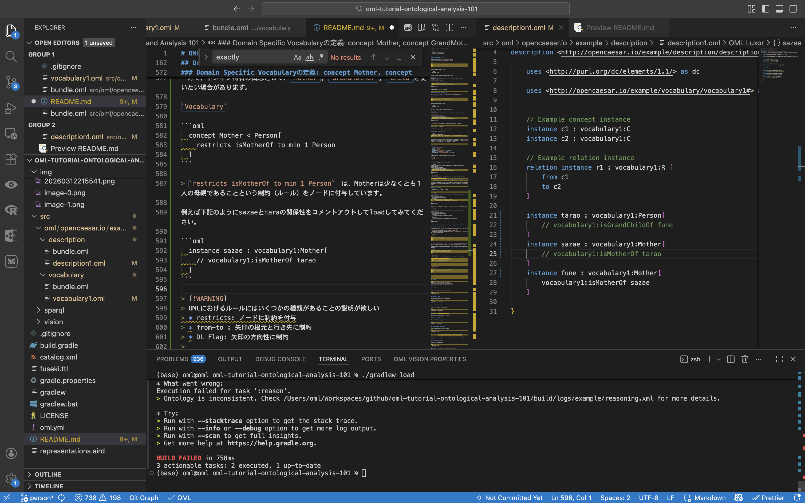

terminal上の下記メッセージの`Check /****/.reasoning.xml for more details.`をクリックします。

```bash
* What went wrong:
Execution failed for task ':reason'.
> Ontology is inconsistent. Check /Users/oml/Workspaces/github/oml-tutorial-ontological-analysis-101/build/logs/example/reasoning.xml for more details.
```

`reasoning.xml`は、OWL2 DL Reasonerを使って、構築したモデルの一貫性をチェックした結果をレポートします。
いわゆる`Model Validation`の実行結果であり、大きく分けて2つの一貫性をチェックしています。

1. Vocabularyが正しく構築されているか？
2. Vocabularyに対して、Descriptionが正しく構築されているか？

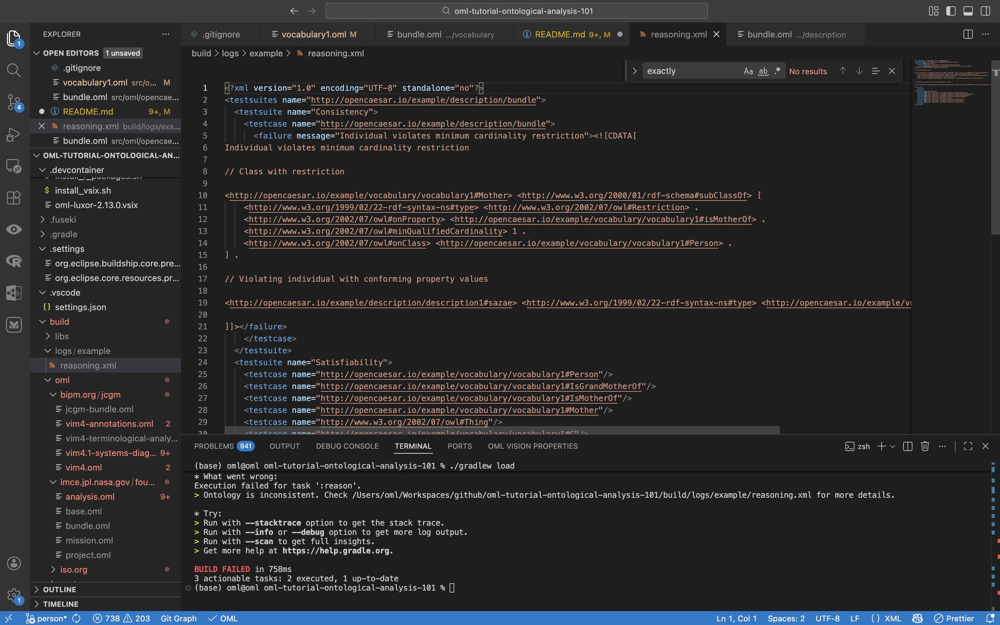


この例では、

> "Individual violates minimum cardinality restriction"><![CDATA[
Individual violates minimum cardinality restriction

となっており、`restriction`として定義した`少なくとも1つのisMotherOf`をもつ制約を`sazae`が違反していることを検出しました。


> [!WARNING]
> OMLにおけるルールにはいくつかの種類があることの説明が欲しい
> * restricts: ノードに制約を付与
> * from-to : 矢印の根元と行き先に制約
> * DL Flag: 矢印の方向性に制約
> 


`Description`

```oml
	instance sazae : vocabulary1:Mother[
		// vocabulary1:isMotherOf tarao
	]
```


### Domain Specific Vocabularyの定義 その２

次に、`GrandMother`を追加します。

```oml
	concept GrandMother < Mother, Person
```

`GrandMother`かつ`Mother`であるが、必ずしも`Mother`が`GrandMother`ではない場合もあります。

このため、

```oml
	concept Mother < Person[
		restricts isMotherOf to min 1 Person
	]
	concept GrandMother < Mother, Person
```

としています。
また、これらは、`isMotherOf`の関係性から自動付与することにします。
以下の2つのルールを追加します。

```oml
	rule infer-mother [
		isMotherOf(a, b) -> Mother(a)
	]
	rule infer-grand-mother [
		isMotherOf(a, b) & isMotherOf(b, c) -> GrandMother(a)
	]
```

`description1.oml`を下記に変更します。
sazae, fune, taraoはいずれも`Person`として、推論で`Mother`と`GrandMother`をラベリングします。

```oml
	instance tarao : vocabulary1:Person[
		// vocabulary1:isGrandChildOf fune
	]
	instance sazae : vocabulary1:Person[
		vocabulary1:isMotherOf tarao
	]
	instance fune : vocabulary1:Person[
		vocabulary1:isMotherOf sazae
	]
```

確かに推論されているかをクエリーで確認する。

```bash
./gradlew load
```

以下のSPARQLクエリーを実行します。

```SPARQL
PREFIX vocabulary1: <http://opencaesar.io/example/vocabulary/vocabulary1#>
SELECT DISTINCT* WHERE {
  ?iri a vocabulary1:Mother;
}
ORDER BY ?iri
```

`fune`と`sazae`が得られます。

`vocabulary1:Mother`を`vocabulary1:GrandMother`としてみます。

```SPARQL
PREFIX vocabulary1: <http://opencaesar.io/example/vocabulary/vocabulary1#>
SELECT DISTINCT* WHERE {
  ?iri a vocabulary1:GrandMother;
}
ORDER BY ?iri
```

`fune` が得られます。


次に`Child`も追加します。

```oml
	concept Child < Person

	concept Mother < Child, Person[
		restricts isMotherOf to min 1 Person
	]
	concept GrandMother < Mother, Person

	rule infer-child [
		isMotherOf(a, b) -> Child(b)
	]	
```

確かに推論されているかをクエリーで確認する。

```bash
./gradlew load
```

```SPARQL
PREFIX vocabulary1: <http://opencaesar.io/example/vocabulary/vocabulary1#>
SELECT DISTINCT* WHERE {
  ?iri a vocabulary1:Child;
}
ORDER BY ?iri
```


少し複雑ですが、こんなクエリも使えます。

```SPARQL
PREFIX vocabulary1: <http://opencaesar.io/example/vocabulary/vocabulary1#>

SELECT DISTINCT ?iri ?type
WHERE {
  VALUES ?componentType { vocabulary1:Person  }
  VALUES ?isMother { vocabulary1:Mother  }
  VALUES ?isGrandMother { vocabulary1:GrandMother  }
  VALUES ?isChild { vocabulary1:Child  }
  
  ?iri a ?componentType.
  OPTIONAL {
    ?iri a ?type .
    FILTER(?type = ?isGrandMother)
  }
  OPTIONAL {
    ?iri a ?type .
    FILTER(?type = ?isMother)
  }
  OPTIONAL {
    ?iri a ?type .
    FILTER(?type = ?isChild)
  } 
}
ORDER BY ?iri

```

### DL FLAG

`description1.oml`を下記に変更します。


```oml
	instance sazae : vocabulary1:Person[
		vocabulary1:isMotherOf sazae
	]
```

```bash
./gradlew load
```

クエリーしてみます。

```SPARQL
PREFIX vocabulary1: <http://opencaesar.io/example/vocabulary/vocabulary1#>

SELECT DISTINCT*
WHERE {
  ?iri a vocabulary1:Person;
  		vocabulary1:isMotherOf ?iri2.
}
ORDER BY ?iri
```
> [!WARNING]
> `sazae` `isMotherOf` `sazae`
> `Person`サザエはサザエの母であるというのは、Vocabularyとしては問題ありませんが、`意味的にはおかしい`。

```oml
	relation entity IsMotherOf[
		from Person
		to Person
		forward isMotherOf
		reverse isChildOf
		irreflexive
	]
```

こんな時は、[DL FLAG](https://www.opencaesar.io/oml/#RelationEntity-LR)を活用することで、ノードに制約を付与することができます。

例えば、`irreflexive` Flagは、自分自身に矢印が戻ってきてはいけないという制約を与えます。

> `irreflexive`
> The irreflexive flag implies that a source instance cannot be related to itself.

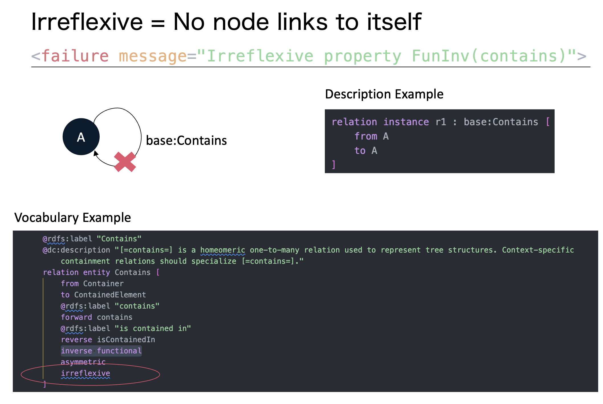

`vocabulary1.oml`を更新します。

```oml
	relation entity IsMotherOf[
		from Person
		to Person
		forward isMotherOf
		reverse isChildOf
		irreflexive
	]
```

ビルドします。

```bash
./gradlew load
```

下記のように、Build failedとなります。

```bash
(base) oml@oml oml-tutorial-ontological-analysis-101 % ./gradlew load

Starting a Gradle Daemon (subsequent builds will be faster)

> Task :oml2owl
1 oml file(s) have changed
3 owl file(s) are saved
1 rules file(s) are saved

> Task :reason FAILED

FAILURE: Build failed with an exception.

* What went wrong:
Execution failed for task ':reason'.
> Ontology is inconsistent. Check /Users/oml/Workspaces/github/oml-tutorial-ontological-analysis-101/build/logs/example/reasoning.xml for more details.
```

`reasoning.xml`を開くと、下記のように`irreflexive`制約に違反していることがわかります。

```xml
      <failure message="Irreflexive property FunInv(isMotherOf)"><![CDATA[
Irreflexive property FunInv(isMotherOf)
```


## -------------------------------------


## Clone

```
git clone https://github.com/UTNAK/oml-tutorial-ontological-analysis-101.git
cd oml-tutorial-ontological-analysis-101
```

## Build

Check the consistency of the dataset

```
./gradlew build
```

## Generate Docs

Generate documentation from dataset

```
./gradlew generateDocs
```

## Start Fuseki Server

Start the Fuseki triple store

```
./gradlew startFuseki
```

Navigate to http://localhost:3030

Verify you see a dataset: `template`

## Stop Fuseki Server

Stop the Fuseki triple store

```
./gradlew stopFuseki
```

## Load Dataset to Fuseki

Load the dataset to Fuseki server

```
./gradlew load
```

Navigate to http://localhost:3030/#/dataset/template/info

Click on `count triples in all graphs` and observe the triple counts

## Run SPARQL Queries

Run the SPARQL queries

```
./gradlew query
```

Inspect the results at `build/results/template`

## Run SHACL Rules
Run the SHACL rules

```
./gradlew validate
```

Inspect the results at `build/logs/template`

## Publish to Maven Local

Publish the OML dataset as an archive in the local maven repo

```
./gradlew publishToMavenLocal
```

Inspect the OML archive

```
ls ~/.m2/repository/io/opencaesar/oml-template
```

## Customize Template

The name of this project is `oml-template`. You can change it to your own project name. The easiest way to do this is to look for the word `template` in this repo and replace it. The files that need to be changes include:

- `.project` (name)
- `.catalog.xml` (first rewriteURI)
- `README.md` (various places)
- `.oml/fuseki.ttl` (fuseki:name)
- `.oml/oml.yml` (various places)
- `src/oml/*` (namespaces of ontologies)
- `src/sparcl/*` (namespaces of ontologies)
- `src/shacl/*` (namespaces of ontologies)


## Getting started

To make it easy for you to get started with GitLab, here's a list of recommended next steps.

Already a pro? Just edit this README.md and make it your own. Want to make it easy? [Use the template at the bottom](#editing-this-readme)!

## Add your files

* [Create](https://docs.gitlab.com/user/project/repository/web_editor/#create-a-file) or [upload](https://docs.gitlab.com/user/project/repository/web_editor/#upload-a-file) files
* [Add files using the command line](https://docs.gitlab.com/topics/git/add_files/#add-files-to-a-git-repository) or push an existing Git repository with the following command:

```
cd existing_repo
git remote add origin http://pergamon.s.tksc.in-jaxa/gitlab/UT/oml-tutorial-01.git
git branch -M main
git push -uf origin main
```

## Integrate with your tools

* [Set up project integrations](http://pergamon.s.tksc.in-jaxa/gitlab/UT/oml-tutorial-01/-/settings/integrations)

## Collaborate with your team

* [Invite team members and collaborators](https://docs.gitlab.com/user/project/members/)
* [Create a new merge request](https://docs.gitlab.com/user/project/merge_requests/creating_merge_requests/)
* [Automatically close issues from merge requests](https://docs.gitlab.com/user/project/issues/managing_issues/#closing-issues-automatically)
* [Enable merge request approvals](https://docs.gitlab.com/user/project/merge_requests/approvals/)
* [Set auto-merge](https://docs.gitlab.com/user/project/merge_requests/auto_merge/)

## Test and Deploy

Use the built-in continuous integration in GitLab.

* [Get started with GitLab CI/CD](https://docs.gitlab.com/ci/quick_start/)
* [Analyze your code for known vulnerabilities with Static Application Security Testing (SAST)](https://docs.gitlab.com/user/application_security/sast/)
* [Deploy to Kubernetes, Amazon EC2, or Amazon ECS using Auto Deploy](https://docs.gitlab.com/topics/autodevops/requirements/)
* [Use pull-based deployments for improved Kubernetes management](https://docs.gitlab.com/user/clusters/agent/)
* [Set up protected environments](https://docs.gitlab.com/ci/environments/protected_environments/)

***

# Editing this README

When you're ready to make this README your own, just edit this file and use the handy template below (or feel free to structure it however you want - this is just a starting point!). Thanks to [makeareadme.com](https://www.makeareadme.com/) for this template.

## Suggestions for a good README

Every project is different, so consider which of these sections apply to yours. The sections used in the template are suggestions for most open source projects. Also keep in mind that while a README can be too long and detailed, too long is better than too short. If you think your README is too long, consider utilizing another form of documentation rather than cutting out information.

## Name
Choose a self-explaining name for your project.

## Description
Let people know what your project can do specifically. Provide context and add a link to any reference visitors might be unfamiliar with. A list of Features or a Background subsection can also be added here. If there are alternatives to your project, this is a good place to list differentiating factors.

## Badges
On some READMEs, you may see small images that convey metadata, such as whether or not all the tests are passing for the project. You can use Shields to add some to your README. Many services also have instructions for adding a badge.

## Visuals
Depending on what you are making, it can be a good idea to include screenshots or even a video (you'll frequently see GIFs rather than actual videos). Tools like ttygif can help, but check out Asciinema for a more sophisticated method.

## Installation
Within a particular ecosystem, there may be a common way of installing things, such as using Yarn, NuGet, or Homebrew. However, consider the possibility that whoever is reading your README is a novice and would like more guidance. Listing specific steps helps remove ambiguity and gets people to using your project as quickly as possible. If it only runs in a specific context like a particular programming language version or operating system or has dependencies that have to be installed manually, also add a Requirements subsection.

## Usage
Use examples liberally, and show the expected output if you can. It's helpful to have inline the smallest example of usage that you can demonstrate, while providing links to more sophisticated examples if they are too long to reasonably include in the README.

## Support
Tell people where they can go to for help. It can be any combination of an issue tracker, a chat room, an email address, etc.

## Roadmap
If you have ideas for releases in the future, it is a good idea to list them in the README.

## Contributing
State if you are open to contributions and what your requirements are for accepting them.

For people who want to make changes to your project, it's helpful to have some documentation on how to get started. Perhaps there is a script that they should run or some environment variables that they need to set. Make these steps explicit. These instructions could also be useful to your future self.

You can also document commands to lint the code or run tests. These steps help to ensure high code quality and reduce the likelihood that the changes inadvertently break something. Having instructions for running tests is especially helpful if it requires external setup, such as starting a Selenium server for testing in a browser.

## Authors and acknowledgment
Show your appreciation to those who have contributed to the project.

## License
For open source projects, say how it is licensed.

## Project status
If you have run out of energy or time for your project, put a note at the top of the README saying that development has slowed down or stopped completely. Someone may choose to fork your project or volunteer to step in as a maintainer or owner, allowing your project to keep going. You can also make an explicit request for maintainers.
