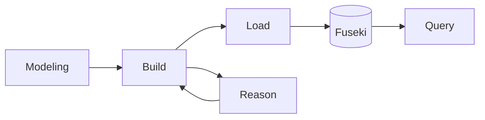

# OML Tutorial： Ontological Analysis 101

## Ontological Modeling and Analysis 

OMLを使ったOntological Modeling and Analysisのワークフローの特徴は、他のシステムモデリング言語と異なり、モデリングの後に、構築したモデルをセマンティックナレッジグラフに変換し、これを探索（クエリー）して分析するプロセスにあります。

  1. Vocabularyモデリング（オントロジー or メタモデル）
  2. Descriptionモデリング（インスタンス）
  3. モデルのビルド
  4. モデルのロード
  5. モデルのクエリ

- 今回のチュートリアルでは、OMLの特徴である構築したモデルをクエリーして分析する`Ontological Analysis`に焦点をあてたウォークスルーを実際に体験して頂きます。




## Repositoryをクローンする。

```
git clone https://github.com/UTNAK/oml-tutorial-ontological-analysis-101.git
cd oml-tutorial-ontological-analysis-101
```

## First Query

### ターミナルを立ち上げる

左上の`≡`をクリックしてTerminalを表示する。


### モデルのビルド

VSCODEの`Terminal`で、`build`コマンドを実行する。

ターミナルで下記コードを実行する。

```bash
./gradlew build
```

下記のように `BUILD SUCCESSFUL`となることを確認する。


### モデルのLoad

```bash
./gradlew load
```

loadコマンドを実行後に出てくる下記のメッセージにあるリンクをクリックする。

```bash
> Task :startFuseki
Fuseki server has now successfully started with pid=78110, listening on http://localhost:3030
```

ブラウザ上で下記のような`Fuseki Endpoint`が立ち上がる。


### モデルのクエリー

`Query` をクリックし、以下のSPARQLクエリを入力します。
出てきた画面の右上にある`Run Query`をクリックすると、クエリー結果が表示されます。

```sparql
PREFIX vocabulary1: <http://opencaesar.io/example/vocabulary/vocabulary1#>
SELECT DISTINCT* WHERE {
  ?s ?p ?o
}
ORDER BY ?iri
```


Build -> Load　を通じて、OMLモデルがOWL RDFグラフデータに変換され、ローカルサーバ上のグラフデータベースにストアされます。
openCAESARのプラットフォームでは、グラフデータをクエリするためのWeb UIとして、Fuseki Endpointが用意されています。

この`Fuseki Web UI（Webコンソール）`は、[Apache Jena Fuseki](https://jena.apache.org/index.html) が提供する
ブラウザベースの管理画面で、[SPARQLクエリ](https://www.w3.org/TR/sparql11-query/)実行・データセット管理・データ操作を行える GUI です。

> Semantic Webの世界では、`Knowledge Graph`を扱うための技術が標準化されており、openCAESARはこの[世界標準のセマンティックウェブ技術](https://www.w3.org/2001/sw/wiki/Main_Page)に基づいたツールセットを構築しています。
> `Knowledge Graph`のイントロダクションとして参考になる情報は[こちら](https://github.com/Edkamb/Edkamb.github.io/blob/master/files/keynote.pdf)。
> 


クエリの入力部分に、SPARQLクエリを打ち込むことで、グラフデータにアクセスできます。以下にいくつかのパターンを示します。


### Query実験その１ 

これは、グラフデータベース上の全てのデータを取得するクエリです。

```SPARQL
SELECT ?subject ?predicate ?object
WHERE {
  ?subject ?predicate ?object
}
LIMIT 25
```

## Ontological Analysis #01

```SPARQL
PREFIX vocabulary1: <http://opencaesar.io/example/vocabulary/vocabulary1#>
SELECT DISTINCT* WHERE {
  ?iri a vocabulary1:C
}
ORDER BY ?iri
```

```SPARQL
PREFIX vocabulary1: <http://opencaesar.io/example/vocabulary/vocabulary1#>
SELECT DISTINCT* WHERE {
  ?iri a vocabulary1:C;
  	vocabulary1:r ?iri2.
}
ORDER BY ?iri
```

## Clone

```
git clone https://github.com/UTNAK/oml-tutorial-ontological-analysis-101.git
cd oml-tutorial-ontological-analysis-101
```

## Build

Check the consistency of the dataset

```
./gradlew build
```

## Generate Docs

Generate documentation from dataset

```
./gradlew generateDocs
```

## Start Fuseki Server

Start the Fuseki triple store

```
./gradlew startFuseki
```

Navigate to http://localhost:3030

Verify you see a dataset: `template`

## Stop Fuseki Server

Stop the Fuseki triple store

```
./gradlew stopFuseki
```

## Load Dataset to Fuseki

Load the dataset to Fuseki server

```
./gradlew load
```

Navigate to http://localhost:3030/#/dataset/template/info

Click on `count triples in all graphs` and observe the triple counts

## Run SPARQL Queries

Run the SPARQL queries

```
./gradlew query
```

Inspect the results at `build/results/template`

## Run SHACL Rules
Run the SHACL rules

```
./gradlew validate
```

Inspect the results at `build/logs/template`

## Publish to Maven Local

Publish the OML dataset as an archive in the local maven repo

```
./gradlew publishToMavenLocal
```

Inspect the OML archive

```
ls ~/.m2/repository/io/opencaesar/oml-template
```

## Customize Template

The name of this project is `oml-template`. You can change it to your own project name. The easiest way to do this is to look for the word `template` in this repo and replace it. The files that need to be changes include:

- `.project` (name)
- `.catalog.xml` (first rewriteURI)
- `README.md` (various places)
- `.oml/fuseki.ttl` (fuseki:name)
- `.oml/oml.yml` (various places)
- `src/oml/*` (namespaces of ontologies)
- `src/sparcl/*` (namespaces of ontologies)
- `src/shacl/*` (namespaces of ontologies)


## Getting started

To make it easy for you to get started with GitLab, here's a list of recommended next steps.

Already a pro? Just edit this README.md and make it your own. Want to make it easy? [Use the template at the bottom](#editing-this-readme)!

## Add your files

* [Create](https://docs.gitlab.com/user/project/repository/web_editor/#create-a-file) or [upload](https://docs.gitlab.com/user/project/repository/web_editor/#upload-a-file) files
* [Add files using the command line](https://docs.gitlab.com/topics/git/add_files/#add-files-to-a-git-repository) or push an existing Git repository with the following command:

```
cd existing_repo
git remote add origin http://pergamon.s.tksc.in-jaxa/gitlab/UT/oml-tutorial-01.git
git branch -M main
git push -uf origin main
```

## Integrate with your tools

* [Set up project integrations](http://pergamon.s.tksc.in-jaxa/gitlab/UT/oml-tutorial-01/-/settings/integrations)

## Collaborate with your team

* [Invite team members and collaborators](https://docs.gitlab.com/user/project/members/)
* [Create a new merge request](https://docs.gitlab.com/user/project/merge_requests/creating_merge_requests/)
* [Automatically close issues from merge requests](https://docs.gitlab.com/user/project/issues/managing_issues/#closing-issues-automatically)
* [Enable merge request approvals](https://docs.gitlab.com/user/project/merge_requests/approvals/)
* [Set auto-merge](https://docs.gitlab.com/user/project/merge_requests/auto_merge/)

## Test and Deploy

Use the built-in continuous integration in GitLab.

* [Get started with GitLab CI/CD](https://docs.gitlab.com/ci/quick_start/)
* [Analyze your code for known vulnerabilities with Static Application Security Testing (SAST)](https://docs.gitlab.com/user/application_security/sast/)
* [Deploy to Kubernetes, Amazon EC2, or Amazon ECS using Auto Deploy](https://docs.gitlab.com/topics/autodevops/requirements/)
* [Use pull-based deployments for improved Kubernetes management](https://docs.gitlab.com/user/clusters/agent/)
* [Set up protected environments](https://docs.gitlab.com/ci/environments/protected_environments/)

***

# Editing this README

When you're ready to make this README your own, just edit this file and use the handy template below (or feel free to structure it however you want - this is just a starting point!). Thanks to [makeareadme.com](https://www.makeareadme.com/) for this template.

## Suggestions for a good README

Every project is different, so consider which of these sections apply to yours. The sections used in the template are suggestions for most open source projects. Also keep in mind that while a README can be too long and detailed, too long is better than too short. If you think your README is too long, consider utilizing another form of documentation rather than cutting out information.

## Name
Choose a self-explaining name for your project.

## Description
Let people know what your project can do specifically. Provide context and add a link to any reference visitors might be unfamiliar with. A list of Features or a Background subsection can also be added here. If there are alternatives to your project, this is a good place to list differentiating factors.

## Badges
On some READMEs, you may see small images that convey metadata, such as whether or not all the tests are passing for the project. You can use Shields to add some to your README. Many services also have instructions for adding a badge.

## Visuals
Depending on what you are making, it can be a good idea to include screenshots or even a video (you'll frequently see GIFs rather than actual videos). Tools like ttygif can help, but check out Asciinema for a more sophisticated method.

## Installation
Within a particular ecosystem, there may be a common way of installing things, such as using Yarn, NuGet, or Homebrew. However, consider the possibility that whoever is reading your README is a novice and would like more guidance. Listing specific steps helps remove ambiguity and gets people to using your project as quickly as possible. If it only runs in a specific context like a particular programming language version or operating system or has dependencies that have to be installed manually, also add a Requirements subsection.

## Usage
Use examples liberally, and show the expected output if you can. It's helpful to have inline the smallest example of usage that you can demonstrate, while providing links to more sophisticated examples if they are too long to reasonably include in the README.

## Support
Tell people where they can go to for help. It can be any combination of an issue tracker, a chat room, an email address, etc.

## Roadmap
If you have ideas for releases in the future, it is a good idea to list them in the README.

## Contributing
State if you are open to contributions and what your requirements are for accepting them.

For people who want to make changes to your project, it's helpful to have some documentation on how to get started. Perhaps there is a script that they should run or some environment variables that they need to set. Make these steps explicit. These instructions could also be useful to your future self.

You can also document commands to lint the code or run tests. These steps help to ensure high code quality and reduce the likelihood that the changes inadvertently break something. Having instructions for running tests is especially helpful if it requires external setup, such as starting a Selenium server for testing in a browser.

## Authors and acknowledgment
Show your appreciation to those who have contributed to the project.

## License
For open source projects, say how it is licensed.

## Project status
If you have run out of energy or time for your project, put a note at the top of the README saying that development has slowed down or stopped completely. Someone may choose to fork your project or volunteer to step in as a maintainer or owner, allowing your project to keep going. You can also make an explicit request for maintainers.
